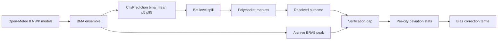

# Deviation Analysis — Temperature Predictions vs Polymarket Resolution

> **Status:** Multi-phase investigation — partially implemented, actively accumulating data.
> **Purpose of this document:** Capture the complete state of the investigation so any future AI agent or human can pick up exactly where work stopped. It records what is DONE, what is PLANNED (in progress), and what is PROPOSED (recommended but not yet implemented).
> **Last updated:** 2026-08-12 (UTC)

---

## 1. System overview

The weather monitor project predicts the **daily maximum temperature for 51 cities** using a **Bayesian Model Averaging (BMA) ensemble of 8 NWP models** served by Open-Meteo. The pipeline bets against **Polymarket "highest temperature" markets**, which resolve to `round(actual_daily_max)` as measured at an **official weather station** (identified by ICAO code in the config).

Verification compares our **archive peak** (the daily max derived from Open-Meteo ERA5 reanalysis grid data) against the **Polymarket resolved outcome**. The core analytical problem this document tracks: *why our peak systematically deviates from the resolved outcome, and what is being done about it.*

**Core pipeline (production):**



**Key units and conventions:**

| Concept | Convention |
|---|---|
| Forecast / `bma_mean` | °C |
| Polymarket US markets | Native °F buckets |
| Polymarket non-US markets | Native °C buckets |
| Aggregated deviation signal | °C (native values preserved separately) |
| Station identity | ICAO code in [`weather_monitor_defaults.json`](vær monitor/weather_monitor_defaults.json) |

---

## 2. Root causes found (the analysis)

### 2.1 Jinan +6.9°C — parsing bug, NOT a real error

The largest apparent deviation (Jinan, +6.9°C) was a **threshold-market parsing bug**. The market in question was a binary *"26°C or higher"* market; the resolver extracted the **threshold (26°C)** as if it were the *actual resolved temperature*. Because our archive peak (~33°C) was compared against 26°C, a fictitious +6.9°C error appeared.

This was corrected by classifying threshold markets separately and excluding them from point-value gap comparisons. Threshold markets now carry `type: "threshold"` and a `lower_bound_c` (and `lower_bound_f` for °F thresholds) instead of a point value.

### 2.2 US cities resolve in °F buckets — quantization noise

US cities resolve in **°F buckets** (e.g. `86-87°F`, `92°F`). Early code converted the **bucket midpoint to rounded °C**, which injected **±0.5–1.0°C of quantization noise** into the comparison.

The fix keeps °F markets in their **native °F unit** (numeric midpoint + original bucket label) and computes verification gaps in the market's native unit.

### 2.3 Systematic ERA5 reanalysis cold bias

- **~−0.7°C mean bias**; **36 of 49 cities under-predict**.
- Root contributors:
  - **Grid-point vs station resolution** — ERA5 grid cells average over areas much larger than a station footprint.
  - **Elevation mismatch** — grid elevation differs from the official station elevation (see high-station list in §5.4).
  - **Missing Urban Heat Island (UHI) correction** — the config already stores `uhi_adjustment` per city, but it is applied only in display paths, not in the forecast `bma_mean` (see §5.1).

### 2.4 Coastal land/sea grid mixing

Coastal cities whose ERA5 grid point mixes **land and sea** suppress the daily max because sea surface temperatures dampen the grid-cell average. Affected cities: **San Francisco, Wellington, Taipei, Shenzhen, Shanghai, Tokyo, Houston, Miami**.

### 2.5 Stale verification legend (cosmetic)

The HTML report legend displayed outdated thresholds. This was cosmetic only and has been fixed (see §3.3).

---

## 3. DONE (measures already implemented)

### 3.1 Taipei station correction

[`weather_monitor_defaults.json`](vær monitor/weather_monitor_defaults.json:3) moved Taipei from a city-center grid point to **Taipei Songshan RCSS** at `(25.0697, 121.5517)`. Commit `362735c`.

All other 7 "gross-error" cities were **confirmed to already point at the correct station**:

| City | ICAO station |
|---|---|
| San Francisco | KSFO |
| Atlanta | KATL |
| Wellington | NZWN |
| Munich | EDDM |
| Houston | KHOU |
| Shenzhen | ZGSZ |
| Jinan | ZSJN |

### 3.2 Fahrenheit markets kept in Fahrenheit

[`_model_quality_tracker.py`](vær monitor/_model_quality_tracker.py:3065) — `_parse_market_question()`:

- **Unit-aware** — returns `unit: "C" | "F"`.
- **°F bucket midpoint** — stored in °F with `unit: "F"` (native unit preserved).
- **Threshold detection** — returns `type: "threshold"` + `lower_bound_c` (and `lower_bound_f` for °F thresholds), so threshold markets are excluded from point-value gaps.
- **Native-unit verification** — the gap comparison at [`_model_quality_tracker.py`](vær monitor/_model_quality_tracker.py:3268) runs in the market's native unit: our °C peak is converted to °F for °F markets, and the OK tolerance is scaled to `1.0°C * 9/5` °F.

[`_fetch_resolved_markets.py`](vær monitor/_fetch_resolved_markets.py:89) — `parse_temp_bracket()` migrated [`_resolved_markets_log.json`](vær monitor/_resolved_markets_log.json) to the new schema:

```
type: "point" | "threshold"
unit: "C" | "F"
value       : numeric midpoint in native unit
temp_f      : °F value (point °F markets)
temp_c      : °C value (point °C markets; legacy field for °F markets)
bucket      : original temperature label
temp_display: original display string
lower_bound_c / lower_bound_f : threshold markets only
```

### 3.3 Stale legend fixed

[`_generate_quality_report.py`](vær monitor/_generate_quality_report.py:1892) now shows the real thresholds:

- **OK** ≤ 1.0°C
- **MINOR** 1.0–2.0°C (edge-affecting)
- **STASJONSFEIL** > 2.0°C (likely wrong station)
- US °F markets are shown in °F.

### 3.4 Per-city deviation statistics (new)

New [`_city_deviation_stats.py`](vær monitor/_city_deviation_stats.py) writes [`_city_deviation_log.json`](vær monitor/_city_deviation_log.json):

- **Append-only samples** — deduplicated by `(city, date)`; never overwritten.
- **Per-city aggregates** recomputed from the full sample history on every run:

```
n, mean_error_c, mae_c, rmse_c, last_error_c, unit
```

- Pairs each resolved **POINT** market with our **`strategies.mean.spill`** (always °C) from the matching run in [`_model_quality_log.json`](vær monitor/_model_quality_log.json), matched on the exact date.
- **Threshold markets are skipped entirely.**
- °F markets are **normalized to °C** for cross-city aggregation while native °F values are preserved (`resolved_value`, `error_native`).
- Pure standard library — runs identically locally and in CI.

Wired into [`.github/workflows/model_quality_pipeline.yml`](vær monitor/.github/workflows/model_quality_pipeline.yml:93) as a `Per-city deviation stats` step, and `_city_deviation_log.json` was added to the auto-commit `file_pattern` ([`.github/workflows/model_quality_pipeline.yml`](vær monitor/.github/workflows/model_quality_pipeline.yml:138)).

---

## 4. PLANNED (the near-term goal now in progress)

**Accumulate the per-city deviation statistics over many days/weeks** — the "large database" — so that a **modular per-city bias correction term** can be derived.

- **Key signal:** `mean_error_c` per city in [`_city_deviation_log.json`](vær monitor/_city_deviation_log.json) (the `cities` block).
- °F markets are **normalized to °C** for aggregation; native °F values are preserved in each sample.
- Once enough samples exist per city, the aggregate `mean_error_c` becomes the per-city bias term (subtract it from `bma_mean`, or feed it into the seasonal bias cache).
- As of 2026-08-12 the log contains the first day's samples (2026-08-11); the database grows one run per day.

---

## 5. PROPOSED (recommended next steps — NOT yet implemented)

### 5.1 Apply stored UHI adjustments to `bma_mean` in the forecast path

The config already stores `uhi_adjustment` per city in [`weather_monitor_defaults.json`](vær monitor/weather_monitor_defaults.json), but it is applied only in **display paths**:

- [`weather_monitor_gui.py`](vær monitor/weather_monitor_gui.py:2193) — `adj_mean = mean_c + uhi`
- [`weather_monitor_cli.py`](vær monitor/weather_monitor_cli.py:2091)
- [`_backtest_30days.py`](vær monitor/_backtest_30days.py:301)

In the production forecast path ([`_model_quality_tracker.py`](vær monitor/_model_quality_tracker.py:1135)) the UHI value is only **stored** as `_uhi_adjustment` in the log; it is **not added to `bma_mean`** before computing the bet level. **Action:** apply `loc.uhi_adjustment` to `bma_mean` in the forecast/spill path so the same correction used for display also drives betting.

### 5.2 Populate the seasonal per-station bias cache

- Either populate the **seasonal per-station bias cache** (if such a structure exists), or
- Apply a **static per-city bias term** (e.g. `mean_error_c`) once enough [`_city_deviation_log.json`](vær monitor/_city_deviation_log.json) data exists.
- Recommended: consume `cities.<name>.mean_error_c` as a bias offset once `n` exceeds a minimum-sample threshold.

### 5.3 Add coastal bias terms for land/sea-mixing cities

Add **+2–4°C** bias terms for coastal cities whose ERA5 grid mixes land and sea:

```
KSFO, NZWN, RCSS, ZGSZ, ZGGG, RJTT, ZSPD, KHOU, KMIA
```

### 5.4 Elevation / lapse-rate correction for high stations

Apply a lapse-rate correction for high-elevation official stations, where the ERA5 grid elevation differs substantially from the station elevation:

| Station | City | Elevation |
|---|---|---|
| MMMX | Mexico City | 2230 m |
| KBKF | Denver | 1726 m |
| LTAC | Ankara | 953 m |
| SBGR | Sao Paulo | 750 m |
| LEMD | Madrid | 609 m |
| ZUUU | Chengdu | 495 m |
| ZUCK | Chongqing | 416 m |

### 5.5 Widen the BMA p5–p95 spread

The BMA `p5–p95` spread currently spans only **0.6–2.7°C**, whereas real station error is **2–4°C**. Widen the ensemble spread (calibration) so the distribution better reflects true station-level uncertainty and the bet-level win probabilities become honest.

---

## 6. Key file map

| File | Purpose |
|---|---|
| [`weather_monitor_defaults.json`](vær monitor/weather_monitor_defaults.json) | 51-city config: station lat/lon (ICAO), `uhi_adjustment`, `station_elevation_m`, city correlations. Source of station truth. |
| [`weather_monitor_cli.py`](vær monitor/weather_monitor_cli.py) | Core `WeatherAnalyzer` / `LocationManager` / forecast logic. Display-path UHI application. |
| [`weather_monitor_gui.py`](vær monitor/weather_monitor_gui.py) | GUI; display-path UHI application (`adj_mean = mean_c + uhi`). |
| [`_model_quality_tracker.py`](vær monitor/_model_quality_tracker.py) | Production BMA tracker. `_parse_market_question()` (unit-aware, threshold detection), native-unit verification, writes `_model_quality_log.json`. |
| [`_fetch_resolved_markets.py`](vær monitor/_fetch_resolved_markets.py) | Fetches resolved Polymarket markets via Gamma API; `parse_temp_bracket()`; writes `_resolved_markets_log.json` / `_resolved_markets.csv`. |
| [`_resolved_markets_log.json`](vær monitor/_resolved_markets_log.json) | Resolved market storage (new schema: bucket/value/temp_f/unit/type). |
| [`_model_quality_log.json`](vær monitor/_model_quality_log.json) | Run history (BMA predictions, strategies, verification entries). |
| [`_city_deviation_stats.py`](vær monitor/_city_deviation_stats.py) | Computes per-city deviation samples + aggregates → `_city_deviation_log.json`. |
| [`_city_deviation_log.json`](vær monitor/_city_deviation_log.json) | Append-only samples + per-city aggregates (n, mean_error_c, mae_c, rmse_c, last_error_c, unit). |
| [`_generate_quality_report.py`](vær monitor/_generate_quality_report.py) | Generates markdown/HTML report; verification legend (OK/MINOR/STASJONSFEIL). |
| [`.github/workflows/model_quality_pipeline.yml`](vær monitor/.github/workflows/model_quality_pipeline.yml) | CI pipeline (hourly + daily close); runs tracker, per-city stats, report, auto-commit. |
| [`src/strategies/weather/ensemble.py`](vær monitor/src/strategies/weather/ensemble.py) | BMA ensemble implementation. |
| [`src/strategies/weather/calibration.py`](vær monitor/src/strategies/weather/calibration.py) | Calibration logic (relevant to p5–p95 spread work in §5.5). |
| [`src/strategies/weather/microclimate.py`](vær monitor/src/strategies/weather/microclimate.py) | Microclimate/UHI modeling (relevant to §5.1/§5.3). |
| [`src/strategies/weather/satellite_correction.py`](vær monitor/src/strategies/weather/satellite_correction.py) | Satellite-based corrections. |

---

## 7. How to pick up from here

1. Confirm the per-city stats are accumulating daily by checking the `cities` block in [`_city_deviation_log.json`](vær monitor/_city_deviation_log.json).
2. When per-city `n` is sufficient, implement the bias correction (§5.2) and UHI-in-forecast-path fix (§5.1) together, since both modify the same `bma_mean → spill` computation.
3. Add the coastal and elevation correction terms (§5.3, §5.4) as static config-driven offsets, then replace them with learned values as data grows.
4. Re-tune the ensemble spread (§5.5) last, after the systematic biases are removed — otherwise the calibration will absorb the bias and over-widen.

> **Constraints honored:** this document was created without editing any code, JSON, or workflow files.
